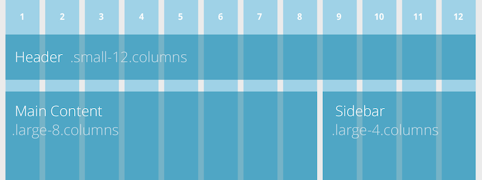
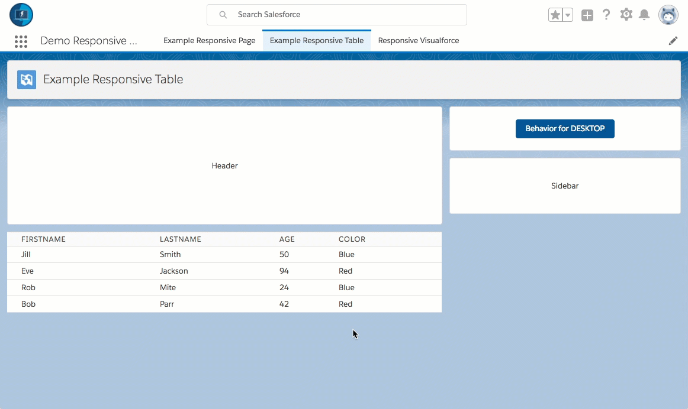
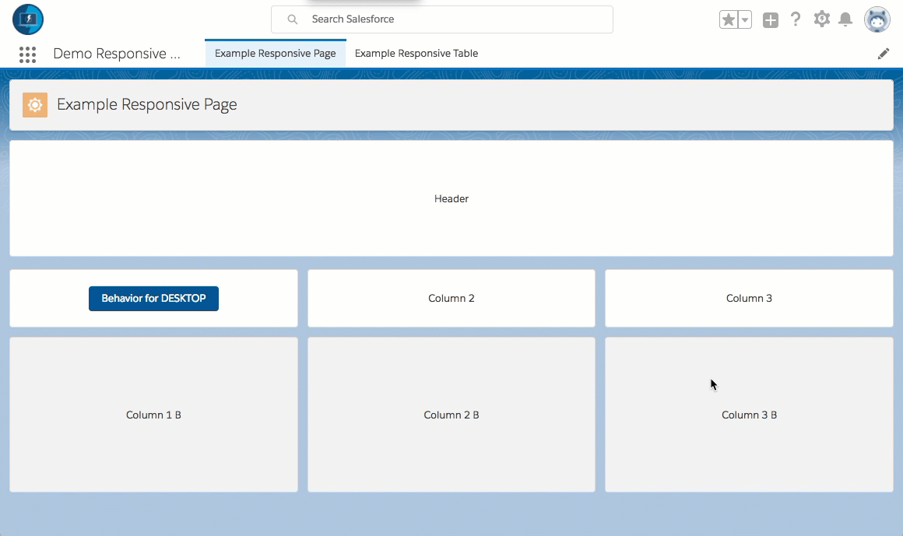
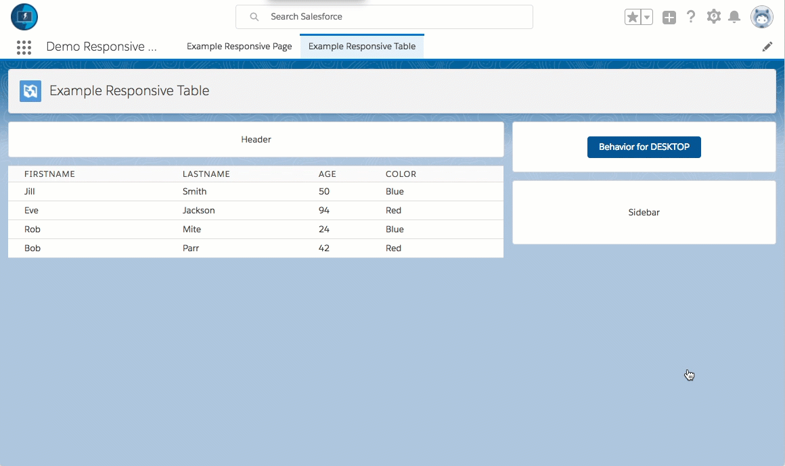

# Overview

The Salesforce UI is built on the [Salesforce Design System](https://lightningdesignsystem.com/getting-started/) - a Responsive/Adaptive Framework.

This can be used:

* Lightning Experience / Salesforce 1
  * Record Pages
  * Standalone Pages
  * Lightning Actions
  * many others
* Stand-alone Lightning Apps
* Lightning Out Components
* Lightning Components for Visualforce
* External pages (like on Heroku)

The foundation for all but the simplest pages and components is a layout grid of some kind. The Design System provides a dedicated component for this purpose imaginatively called the [Grid System](https://www.lightningdesignsystem.com/components/utilities/grid/). If you have used other CSS frameworks such as [Bootstrap](http://getbootstrap.com/), you will be familiar with the concept of a grid. If not, in very brief terms, a grid allows you to divide your page into rows and columns. You can then arrange your markup so that it is rendered in a particular row/column. Grids can be nested allowing for complex layouts.

**Please note: sample code (metadata api and dx formats) are available in the [mdapi](./mdapi) and [dx](./dx) folders above**

**For More Information, please visit:**

[Lightning Design System Trailhead](https://trailhead.salesforce.com/modules/lightning_design_system/)

Or 

[Lightning Design System homepage](https://lightningdesignsystem.com/getting-started/)

Please note that this can be a very large discussion based on the types of responsive technical debt.

Such as creating Responsive Behavior (behavior that is different based on phone vs desktop for example)

This can be determined through the [FormFactor api methods](https://developer.salesforce.com/docs/atlas.en-us.lightning.meta/lightning/expr_browser_value_provider.htm), but often should be limited as much as possible.

# Demo

As Lightning Components are built with the Lightning Design System behind the sheets, this means that layouts have many more options of creation and layout.

So we can resize, and adjust and the layout still works.

Or leverage tables in a form factor that still works regardless of device (ex: Phones / Tablets and Desktops)

## Visualforce

But this doesn't just work using the Lightning Experience / Salesforce 1.

Lightning Out provides a means to use these Lightning Components within your Visualforce Pages.

Or you can simply use the CSS Framework in your generation of HTML files.

# TLDR How

* Bullet_points_of_how_this_was_done

---

# Demo code overview

The metadata for this example can be found under the [mdapi](./mdapi) folder.

The Salesforce CLI version of this code can be found under the [dx](./dx) folder.

This can also be installed using Unlocked Packages (previously known as Developer Controlled Packages) in sandboxes using this url:

[url](url)

## Installing via the Salesforce CLI

This assumes you have already installed the [Salesforce CLI]() and [Connected the Salesforce CLI to your org](https://developer.salesforce.com/docs/atlas.en-us.sfdx_dev.meta/sfdx_dev/sfdx_dev_auth_web_flow.htm).

However, the Salesforce CLI can be used with any org and does not require Salesforce DX to be enabled. (Although enabling the DX / Dev Hub would give some great benefits, and would only require care of [certain object permissions: Scratch Org Info, ActiveScratchOrg, NamespaceRegistry](https://developer.salesforce.com/docs/atlas.en-us.sfdx_setup.meta/sfdx_setup/sfdx_setup_add_users.htm) - as they are not available in all orgs)

**1.** Run the following command:

	sfdx force:mdapi:deploy -d mdapi -u [[orgAlias]] -w

**2.** Add the permission set to your user

	sfdx force:user:permset:assign -n Ticket_Manager -u [[orgAlias]]
	
**3.** Upload the data

	sfdx force:data:tree:import -f data/tree/Ticket__c.json -u [[orgAlias]]
	
...

Thats it, you can now open the org, and find the 'ticket' object in the 'all tabs' search.

	sfdx force:org:open -u [[orgAlias]]

# Bit more detail...

... TBD if needed