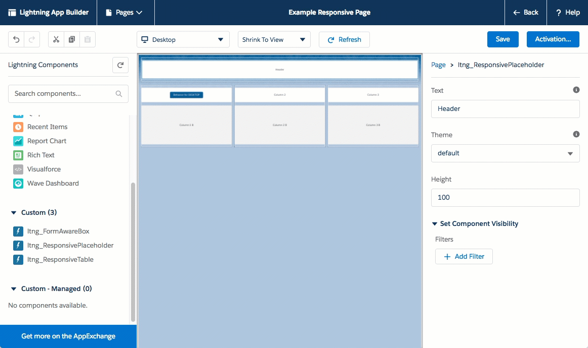
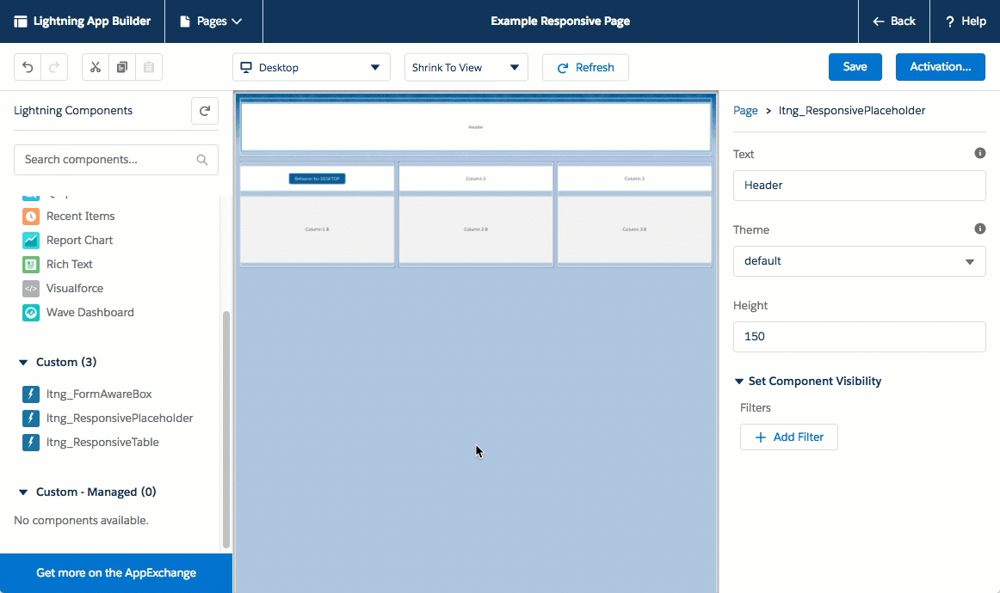

# Overview

Please see the [Installation](#install) section below for more on how to install on your Sandbox / Demo org.

**Please note: sample code (metadata api and dx formats) are is also available in the [mdapi](./mdapi) and [dx](./dx) folders above**

---

The Salesforce UI is built on the [Salesforce Design System](https://lightningdesignsystem.com/getting-started/) - a Responsive/Adaptive Framework.

This can be used:

* Lightning Experience / Salesforce 1
  * Record Pages
  * Standalone Pages
  * Lightning Actions
  * many others
* Stand-alone Lightning Apps
* Lightning Out Components
* Lightning Components for Visualforce
* External pages (like on Heroku)

The foundation for all but the simplest pages and components is a layout grid of some kind. The Design System provides a dedicated component for this purpose imaginatively called the [Grid System](https://www.lightningdesignsystem.com/components/utilities/grid/). If you have used other CSS frameworks such as [Bootstrap](http://getbootstrap.com/), you will be familiar with the concept of a grid. If not, in very brief terms, a grid allows you to divide your page into rows and columns. You can then arrange your markup so that it is rendered in a particular row/column. Grids can be nested allowing for complex layouts.

**Please note: sample code (metadata api and dx formats) are available in the [mdapi](./mdapi) and [dx](./dx) folders above**

**For More Information, please visit:**

[Lightning Design System Trailhead](https://trailhead.salesforce.com/modules/lightning_design_system/)

Or 

[Lightning Design System homepage](https://lightningdesignsystem.com/getting-started/)

Please note that this can be a very large discussion based on the types of responsive technical debt.

Such as creating Responsive Behavior (behavior that is different based on phone vs desktop for example)

This can be determined through the [FormFactor api methods](https://developer.salesforce.com/docs/atlas.en-us.lightning.meta/lightning/expr_browser_value_provider.htm), but often should be limited as much as possible.

# Demo

As Lightning Components are built with the Lightning Design System behind the sheets, this means that layouts have many more options of creation and layout.

We can add components through a drag and drop interface within a responsive layout...

.

.

.

.

We can prepare how the layout will behave on any FormFactor.

.

.

.

.

We can even have components decide their sizing.

.

.

.

.

So we can resize, and adjust and the layout still works.

.

.

.

.

Or leverage tables in a form factor that still works regardless of device (ex: Phones / Tablets and Desktops)

.

## Visualforce

But this doesn't just work using the Lightning Experience / Salesforce 1.

Lightning Out provides a means to use these Lightning Components within your Visualforce Pages.

Or you can simply use the CSS Framework in your generation of HTML files.

(In this case, we're using the different forms of [Tiles](https://www.lightningdesignsystem.com/components/tiles/), [Cards](https://www.lightningdesignsystem.com/components/cards/), and [PageHeaders](https://www.lightningdesignsystem.com/components/page-headers/) )

[You can see the code for the page here](dx/force-app/main/default/pages/ltng_ResponsiveVisualforce.page)

# How to Use

## App Builder

* Using the concepts from the [Lightning App Builder module](https://trailhead.salesforce.com/en/modules/lightning_app_builder)
  * We make Lightning Components simply using the [Box styles](https://lightningdesignsystem.com/utilities/box/#content)
  * See the components for more on styles / height

## Lightning Layout

[Lightning Layout](https://developer.salesforce.com/docs/atlas.en-us.lightning.meta/lightning/aura_compref_lightning_layout.htm) takes much of the difficulty away of creating grids and alignment as it creates the necessary html (to leverage the Lightning Design System)

Much of the layouts created by the App Builder can be recreated very quickly (and with more control) using Lightning Layout.

## Visualforce

You can buld a Visualforce App with Lightning Design System, and there is a [very nice Trailhead module to help](https://trailhead.salesforce.com/projects/workshop-lightning-design-system-visualforce).

A very bare-bones Visualforce page does not need much to leverage Lightning Design System

	<apex:page showHeader="false" standardStylesheets="false" sidebar="false" applyHtmlTag="false" applyBodyTag="false" docType="html-5.0">
		<!-- Import the Design System style sheet -->
		<apex:slds />
		
		<!-- everything inside the slds-scope is under LDS -->
		

			
			<!-- spinner https://lightningdesignsystem.com/components/spinners/#content -->
			

				Loading
				

				

			

			
		

	</apex:page>
	
This uses the always updated Lightning Design System.
But please note there are [other options](https://lightningdesignsystem.com/downloads/), such as a custom build or use of pre-processors using design tokens.

**Please Note:**
If you need to use svg icons, you will need to include the html / body tags, so the `xlink` namespaces are understood.

	<apex:page showHeader="false" standardStylesheets="false" sidebar="false" applyHtmlTag="false" applyBodyTag="false" docType="html-5.0">
	<head>
		<meta charset="utf-8" />
		<meta http-equiv="x-ua-compatible" content="ie=edge" />
		<title>Salesforce Lightning Design System Trailhead Module</title>
		<meta name="viewport" content="width=device-width, initial-scale=1" />
		<!-- Import the Design System style sheet here instead of body -->
		<apex:slds />
	</head>
	<body>
		...
	</body>
	</html>
	</apex:page>

## Detecting Form Factor

We can detect the OS / whether mobile / desktop etc. using the [Lightning Component $Browser utility](https://developer.salesforce.com/docs/atlas.en-us.lightning.meta/lightning/expr_browser_value_provider.htm)

In this case it is just a single line:

	var device = $A.get("$Browser.formFactor");
	alert("You are using a " + device);
	//-- alerts: You are using a Desktop

# Install

There are three methods available for you to install this demo, so you can play around with it:

(Please note, all are intended as demonstrations and are not intended for deployment to Production as is)

* [Install via URL](#install-via-url)
* [Install Demo via Salesforce CLI](#install-via-salesforce-cli)

## Install via URL

This works very similar to an App Exchange install.

Please login to an available sandbox and click the link below.
[https://test.salesforce.com/packaging/installPackage.apexp?p0=04t6A000003OjvjQAC](https://test.salesforce.com/packaging/installPackage.apexp?p0=04t6A000003OjvjQAC)

(or simply navigate to `https://YOUR_SALESFORCE_INSTANCE/packaging/installPackage.apexp?p0=04t6A000003OjvjQAC`  
if you are already logged in)

It is recommended to install for Admins Only (but all options will work)

##### Run the Demos

Thats it. See the [How to Use](#how-to-use) section for how to use the app.

## Installing via the Salesforce CLI

This assumes you have already installed the [Salesforce CLI]() and [Connected the Salesforce CLI to your org](https://developer.salesforce.com/docs/atlas.en-us.sfdx_dev.meta/sfdx_dev/sfdx_dev_auth_web_flow.htm).

However, the Salesforce CLI can be used with any org and does not require Salesforce DX to be enabled. (Although enabling the DX / Dev Hub would give some great benefits, and would only require care of [certain object permissions: Scratch Org Info, ActiveScratchOrg, NamespaceRegistry](https://developer.salesforce.com/docs/atlas.en-us.sfdx_setup.meta/sfdx_setup/sfdx_setup_add_users.htm) - as they are not available in all orgs)

**1.** Run the following command:

	sfdx force:source:push -u [[orgAlias]]

**2.** Add the permission set to your user

	sfdx force:user:permset:assign -n LightningResponsiveTester -u [[orgAlias]]
	
...

Thats it, you can now open the org, and find the 'ticket' object in the 'all tabs' search.

	sfdx force:org:open -u [[orgAlias]]

# Bit more detail...

... TBD if needed